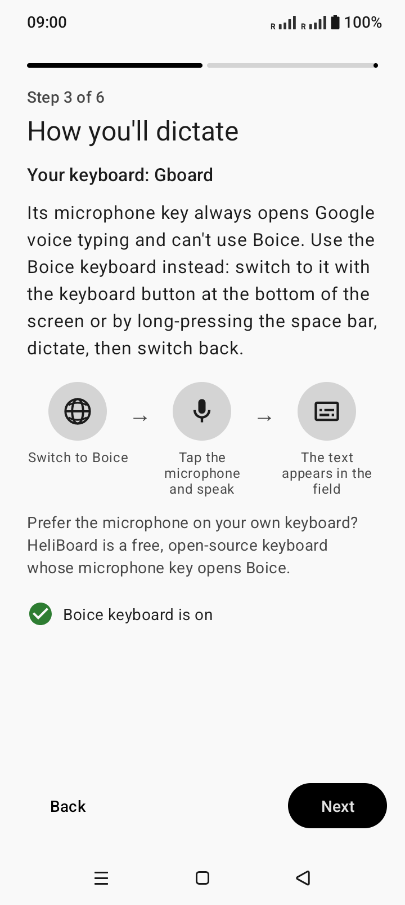
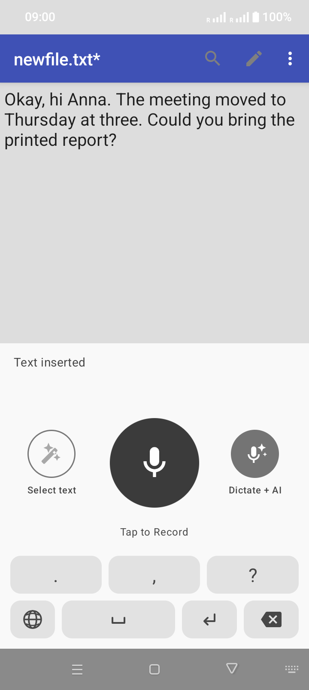
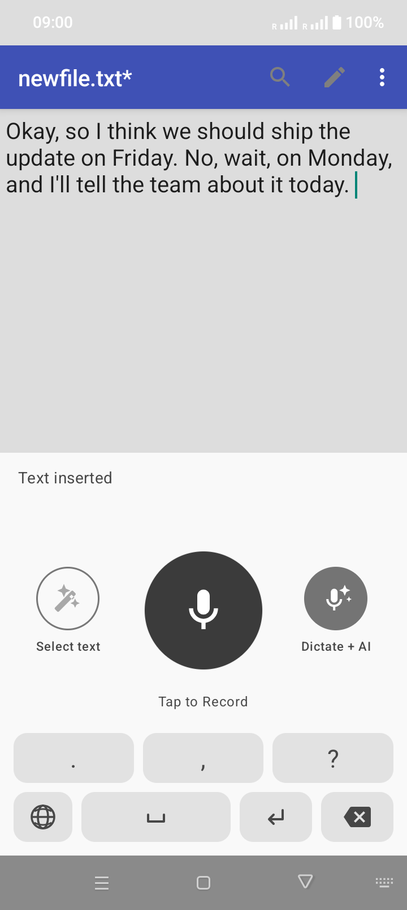
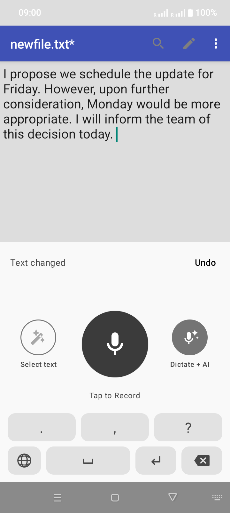
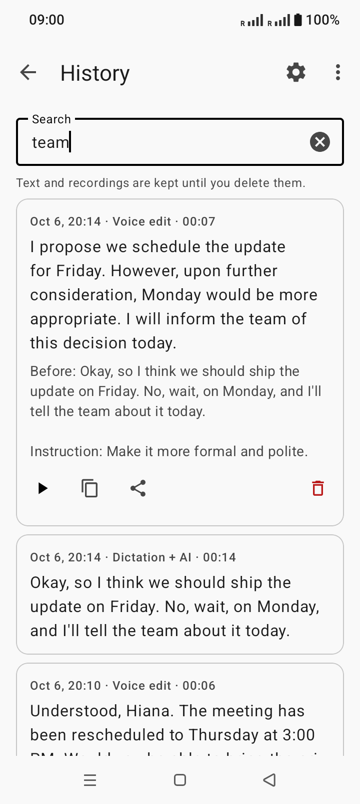

# Boice (Android)

Private speech-to-text for Android. Speech is transcribed on the phone and typed into any app; optionally an AI model of your choice cleans the text up or edits it on a spoken instruction.

> [!IMPORTANT]
> **Unofficial fork.** Boice is an independent fork of
> [Offline Voice Input](https://github.com/notune/android_transcribe_app) by Noah Mühl.
> It is not affiliated with or endorsed by the upstream project. See
> [what the fork adds](#what-this-fork-adds).

## Why this app

- **Your voice stays on the phone.** Recognition runs on-device and works in airplane mode. No account, no tracking.
- **Works with the keyboard you already use.** Tap the microphone in SwiftKey, HeliBoard and others, or use the built-in voice keyboard.
- **Edit text by voice.** Select text, tap the wand, say "make this shorter" or "translate to German".
- **Your own AI, or none.** Cleanup and editing work with any OpenAI-compatible server, including a local Ollama or LM Studio. Off by default.
- **Nothing gets lost.** If the text field is gone when transcription finishes, the text goes to the clipboard, and every dictation is kept in an on-device history with its recording.
- **Free and open source** (MIT).

## Install

[](https://github.com/dmtnndxr/android_transcribe_app/releases/latest)
[](https://apps.obtainium.imranr.dev/redirect?r=obtainium://add/https://github.com/dmtnndxr/android_transcribe_app)

1. Download the APK from the [latest release](https://github.com/dmtnndxr/android_transcribe_app/releases/latest) (about 460 MB: the speech model is inside).
2. Open the file. Android asks once to allow installs from your browser or file manager.
3. Open the app and grant the microphone permission.

**Updates.** The app doesn't update itself. Either install a newer APK over the old one (settings, models and history are kept), or add the repository to [Obtainium](https://github.com/ImranR98/Obtainium) with the badge above and it will fetch new releases from GitHub.

Requirements: Android 8.0 or newer, a 64-bit ARM phone (arm64-v8a). The app ID is `io.github.dmtnndxr.boice`, so it installs alongside the original app.

Looking for the original project? Visit the
[upstream repository](https://github.com/notune/android_transcribe_app) or install
the [original Offline Voice Input from Google Play](https://play.google.com/store/apps/details?id=dev.notune.transcribe).

## What this fork adds

| | Original | Boice |
|---|---|---|
| Offline dictation, live subtitles, audio-file transcription, custom GGUF models | ✅ | ✅ |
| AI post-processing with your own OpenAI-compatible server | — | ✅ |
| Voice editing of selected text (the wand) | — | ✅ |
| Live text while you speak (streaming models) | — | ✅ |
| Cancel during recording, transcription or AI; Undo after a voice edit | — | ✅ |
| Punctuation keys on the voice keyboard | — | ✅ |
| Text copied to the clipboard when its field is gone | — | ✅ |
| On-device history with recordings and search | — | ✅ |
| Distribution | Google Play | GitHub Releases |

The comparison is against upstream 0.1.18, the version the fork is based on.

## Features

- **Voice input in any app:** Tap the microphone on the keyboard you already use (SwiftKey, etc.) or a website's voice search, and your speech is transcribed straight into the text field. The app registers as your device's speech-to-text provider.
- **100% offline & private:** The Parakeet TDT model runs entirely on-device — no audio ever leaves your phone, and no network is required. (The one exception is *AI post-processing*, below: it is off by default, and even then only the finished text is sent, never audio.)
- **Live Subtitles:** Real-time captions for any audio/video playing on your device.
- **Transcribe audio files:** Share an audio file to the app, or open it with the app, to get its text.
- **Optional voice keyboard:** A built-in keyboard you can switch to for voice input wherever you prefer it.
- **Supported Languages:** Bulgarian, Croatian, Czech, Danish, Dutch, English, Estonian, Finnish, French, German, Greek, Hungarian, Italian, Latvian, Lithuanian, Maltese, Polish, Portuguese, Romanian, Slovak, Slovenian, Spanish, Swedish, Russian, Ukrainian.
- **Custom models:** Import any [transcribe.cpp](https://github.com/handy-computer/transcribe.cpp) GGUF model (Whisper, Nemotron streaming, Canary, more Parakeet variants, …) from a downloaded file. Streaming models show the text while you speak.
- **Optional AI post-processing:** A second microphone on the voice keyboard runs your transcription through an LLM before inserting it — fixing grammar, reformatting, translating, or whatever your prompt asks for. Works with any OpenAI-compatible endpoint, including a local Ollama or LM Studio. Off by default.
- **Voice editing of selected text:** Select text in an editor, tap the wand on the voice keyboard, and speak an instruction such as “make this shorter.” The replacement is applied only if the same text is still selected.
- **History:** Every dictation is saved on the phone with its recording, the recognized text and the final text. Search it, replay it, copy or share it. Can be turned off.
- **Text is never lost:** If you leave the field before transcription finishes, the text is copied to the clipboard instead of being typed somewhere else.

All settings are described in the [settings reference](docs/settings.md).

## Screenshots

| Setup that fits your keyboard | Dictation | AI post-processing |
|---|---|---|
|  |  |  |
| **Voice edit of selected text** | **History** | **Live subtitles** |
|  |  |  |

Dark theme versions are in [.screenshots/dark](.screenshots/dark). The screenshots are retaken with [tools/screenshots.sh](tools/screenshots.sh).

## Usage

### Voice input in any app (recommended)

1. Open **Boice** once and grant the microphone permission. The home screen shows a **Voice input** status — green when you're ready to go.
2. In any app, tap the **microphone** on your keyboard (e.g. Microsoft SwiftKey) or the voice-search mic on a website. A compact panel slides up over the app you're in, you speak, and your words are inserted as text. Tap to stop — or enable *Auto-stop after silence* in the app's settings to have it stop by itself.

The app plugs into Android's speech-to-text in **three** ways, so it works with a wide range of keyboards and apps:

| Path | Who uses it | What happens |
|---|---|---|
| **Voice-input popup** (`RECOGNIZE_SPEECH`) | SwiftKey, website voice search, many apps | The compact bottom panel opens over the current app |
| **System speech service** (`RecognitionService`) | Keyboards/apps using Android's `SpeechRecognizer` | Recognition runs invisibly in the background with automatic endpointing |
| **Voice keyboard (IME)** | Any keyboard, via the keyboard switcher — also HeliBoard/AnySoftKeyboard-style "switch to voice IME" mic keys | The dedicated voice keyboard opens |

Tap **Try voice input** on the home screen to test the whole flow in one tap.

**Keyboard notes** (mic-key behavior verified against each keyboard's source and tested in the emulator):

- **Microsoft SwiftKey** (not open source) opens the compact voice panel directly, like website voice search does. If SwiftKey's own voice typing opens instead, go to SwiftKey Settings → *Rich input* → turn off **Multi-modal voice typing**.
- **AnySoftKeyboard** is the open-source way to get the panel: its mic key fires the standard speech intent as long as no *voice keyboard* is enabled on the system. (If one is enabled — ours or Google's — it switches to that instead.)
- **HeliBoard, FlorisBoard, OpenBoard, Fossify Keyboard, Unexpected Keyboard:** their mic key never opens the panel — it switches to the system *voice input keyboard*. Enable the **Boice** keyboard (see below) and it opens automatically; its keyboard-switch key takes you back. **FUTO Keyboard** ships its own built-in voice input.
- **Gboard:** only uses Google's own voice typing, so it can't hand speech to this app at all.
- If Android shows a chooser, pick **Boice** and tap **Always**. If another app always opens, clear its default in *Settings → Apps*.

### Dedicated voice keyboard (optional)

Prefer voice input as its own keyboard? Enable the **Boice** keyboard via *Open Keyboard Settings* on the home screen, switch to it from your keyboard switcher, then tap **Tap to Record**. By default the recording keeps running even if you switch apps or the keyboard closes (turn off *Record in background* in settings if you don't want that) — the text is inserted when you come back.

### AI post-processing (optional)

The voice keyboard can show a **second, smaller microphone** that transcribes exactly like the main one, then sends the text to an LLM before inserting it. Use it to fix grammar and punctuation, reformat into bullet points, translate, or anything else you write a prompt for. The main microphone is untouched and stays fully offline.

Set it up in the app under **Set up AI post-processing**:

1. Turn on **Enable AI post-processing** — this is what makes the second mic appear on the keyboard.
2. Pick a **preset** to fill in the address, then adjust it. Any OpenAI-compatible `/chat/completions` endpoint works:

   | Server | Base URL |
   |---|---|
   | Ollama | `http://<host>:11434/v1` |
   | LM Studio | `http://<host>:1234/v1` |
   | llama.cpp server | `http://<host>:8080/v1` |
   | OpenAI | `https://api.openai.com/v1` |
   | Groq | `https://api.groq.com/openai/v1` |
   | OpenRouter | `https://openrouter.ai/api/v1` |
   | Anthropic | `https://api.anthropic.com/v1` |

   For a server on your own machine, replace `localhost` with that machine's LAN IP — `localhost` on a phone means the phone. Ollama also needs `OLLAMA_HOST=0.0.0.0` to accept connections from other devices.
3. Enter the **API key** (leave empty for local servers) and the **model** name.
4. Edit the **prompt** if you want. `${output}` is replaced with what you dictated; leave the placeholder out and your prompt is sent as an instruction with the transcription as a separate message.
5. Hit **Send test sentence** to confirm it all works before relying on it mid-typing.

The separate **Selected-text editing** settings page controls the wand. It reuses
the AI post-processing server, API key and model by default; you can override only the
model, edit the selection editor's system prompt, reset that prompt to its safe
default, and run a dedicated test request.

Notes:

- **Cancel and undo.** The voice keyboard exposes Cancel while recording, transcribing, or waiting for AI. After a voice edit replaces selected text, Undo is offered briefly and only runs if the replacement is still unchanged.
- **Nowhere to insert.** If the field you dictated into is gone when the text is ready, the text is copied to the clipboard (or offered on the keyboard next time, if you turn copying off). It is also in the history.
- **Failures never lose your words.** If the server is unreachable, the key is rejected, or the request times out, the raw transcription is inserted anyway and the keyboard's status line says what went wrong.
- **Small models disappoint.** Anything under ~3B parameters tends to ignore the instruction and paraphrase or answer your text instead of cleaning it up.
- **Privacy.** Text dictated with the second mic leaves the device. Audio never does. Point it at a local server to keep everything on your own network.
- **Plain HTTP.** LAN servers are reached over `http://`, so the transcription and API key travel unencrypted; the settings screen warns when the address is non-loopback `http://`. Fine on a trusted network, not over the open internet.
- The API key is stored in the app's private storage in plain text, the same protection the other settings get. It is not hardware-backed.

### Live subtitles

Tap **Start Live Subtitles** and choose *Share entire screen* to get real-time, on-device captions for any audio or video playing on your device.

**Advanced: skip the screen-capture dialog.** Android shows a "Start recording or casting?" consent dialog every time subtitles start. You can pre-approve it once via adb — after that, subtitles start instantly and the setting survives reboots (USB debugging can be turned off again afterwards):

```bash
adb shell appops set --user 0 io.github.dmtnndxr.boice PROJECT_MEDIA allow
```

To undo it:

```bash
adb shell appops set --user 0 io.github.dmtnndxr.boice PROJECT_MEDIA default
```

This relies on the undocumented `PROJECT_MEDIA` app-op; on some OEM builds it may not work or may get reset by the system — the normal dialog remains the fallback. The same instructions are shown in-app under *Skip the permission dialog (advanced)*.

### Custom speech models

The built-in Parakeet model works out of the box. Under **Manage speech models** you can additionally import any [transcribe.cpp](https://github.com/handy-computer/transcribe.cpp) GGUF model: download a `.gguf` file in your browser (the in-app *Where to get models* dialog lists direct links, e.g. a tiny 135 MB English-only Parakeet, the multilingual Nemotron 3.5 streaming model with punctuation, or Whisper large-v3-turbo), then import it via the system file picker and select it. The app never downloads models itself — files are simply copied into the app's private storage. An optional language hint (e.g. `en-US`, or `auto`) can be set for imported models.

## Technical details

- **Core:** Rust (`cdylib`) for audio capture and the engine, with a thin Java layer for the Android UI, the input method and the speech service.
- **Inference:** [transcribe.cpp](https://github.com/handy-computer/transcribe.cpp) (ggml) on the CPU. Any GGUF model it supports can be imported.
- **Built-in model:** NVIDIA Parakeet TDT 0.6B v3, Q4_K_M GGUF, about 485 MB, shipped inside the APK. Nothing is downloaded at first launch.
- **Streaming:** models that support it (Nemotron streaming) transcribe while you speak; the others transcribe after you stop.
- **Integration:** an input method (IME), a `RecognitionService` for apps that use Android's `SpeechRecognizer`, and a `RECOGNIZE_SPEECH` activity for keyboards that fire the speech intent.
- **AI:** a plain OpenAI-compatible `/chat/completions` client with no SDK. Connect timeout 10 s, reply timeout 45 s.
- **Platform:** Android 8.0+ (API 26), target API 36, arm64-v8a only.
- **Storage:** settings, models and history (SQLite plus WAV files) live in app-private storage. History is excluded from backups.

What leaves the phone:

| Data | When | Where |
|---|---|---|
| Audio | Never | — |
| Dictated text | Only with **Dictate + AI** | The server you configured |
| Selected text and your spoken instruction (as text) | Only when you use the wand | The server you configured |
| API key | With those requests | The server you configured |

The internet permission exists only for these requests. With AI post-processing off, the app makes no network connections.

Other permissions: microphone (dictation), screen capture and display over other apps (live subtitles), notifications (the subtitles service notice).

## Prerequisites

| Dependency | Installation |
|---|---|
| **JDK 17** | Android Studio (bundled) or `sudo pacman -S jdk17-openjdk` |
| **Android SDK** | Via Android Studio or `sdkmanager` |
| **Android NDK** | `sdkmanager "ndk;30.0.15729638"` |
| **Rust** | [rustup.rs](https://rustup.rs) + `rustup target add aarch64-linux-android` |
| **cargo-ndk** | `cargo install cargo-ndk` |

### Local Configuration

Create a `local.properties` file in the project root (this file is gitignored):

```properties
sdk.dir=/path/to/your/Android/Sdk
```

If your default Java is not JDK 17+, set `org.gradle.java.home` in your
user-level `~/.gradle/gradle.properties` (not in the repository):

```properties
org.gradle.java.home=/path/to/jdk17
# Example: /Applications/Android Studio.app/Contents/jbr/Contents/Home
```

## Building

### Verification without a full toolchain

Type-checking the app and running the post-processing tests doesn't need the
NDK, the Rust toolchain or the speech model. `tools/verify/` does both in a
container, so a machine with only Docker can check a change:

```sh
tools/verify/run.sh          # logic tests + resource validation + javac
tools/verify/run.sh clean    # remove the image and cache volume afterwards
```

See [tools/verify/README.md](tools/verify/README.md) for what each tier covers
and what it deliberately doesn't. Building an actual APK still needs the full
setup below.

### Plus debug APK (installs alongside the original)
```bash
./gradlew assemblePlusDebug
# Output: app/build/outputs/apk/plus/debug/app-plus-debug.apk
```

### Standard release APK
```bash
./gradlew assembleStandardRelease
# Output: app/build/outputs/apk/standard/release/app-standard-release.apk
```

### Release AAB (Google Play)
```bash
./gradlew bundleStandardRelease
# Output: app/build/outputs/bundle/standardRelease/app-standard-release.aab
```

### Signing

For release builds, place a `release.keystore` in the project root and set these environment variables:

```bash
export KEY_ALIAS=release
export KEY_PASS=yourpassword
export STORE_PASS=yourpassword
```

### Model Assets

The built-in Parakeet TDT GGUF model (~485 MB) is automatically downloaded from HuggingFace during the first build via a Gradle task. The checksum is verified with SHA-256. No manual download is needed.

## Project Structure

```
├── app/
│   └── src/main/
│       ├── AndroidManifest.xml
│       ├── java/dev/notune/transcribe/   # Android Java code
│       ├── res/                          # Resources (layouts, drawables, etc.)
│       ├── assets/                       # Model files (downloaded at build time)
│       └── jniLibs/                      # Native .so files (built by cargo-ndk)
│   └── src/plus/res/                     # Plus edition: name and icon
├── src/                                  # Rust source code (cdylib)
├── docs/                                 # Settings reference, roadmap, branding
├── Cargo.toml                            # Rust crate manifest
├── build.gradle.kts                      # Root Gradle config
├── app/build.gradle.kts                  # App module config (AGP 8.13.2)
├── settings.gradle.kts
├── gradle.properties
└── fastlane/metadata/android/            # F-Droid metadata
```

## Acknowledgments

- **Speech Model:** [Parakeet TDT 0.6b v3](https://huggingface.co/nvidia/parakeet-tdt-0.6b-v3) by NVIDIA.
    - GGUF conversion by [handy-computer](https://huggingface.co/handy-computer/parakeet-tdt-0.6b-v3-gguf).
    - Licensed under [CC-BY 4.0](https://creativecommons.org/licenses/by/4.0/).
- **Inference Backend:** [transcribe.cpp](https://github.com/handy-computer/transcribe.cpp) by CJ Pais / Handy Computer.
- **AI cleanup** is modeled on [Handy](https://github.com/cjpais/handy)'s [post-processing](https://handy.computer/docs/post-processing) — same idea of a separate trigger for the processed variant, and the same `${output}` prompt placeholder.

## License

[MIT](LICENSE)
